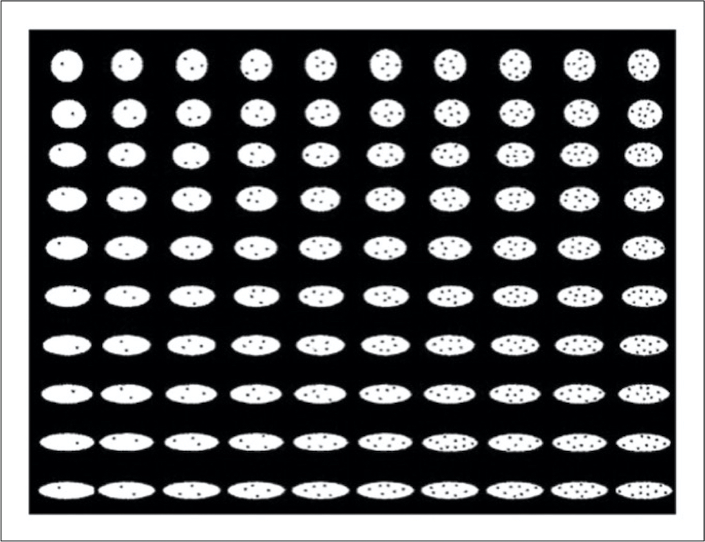
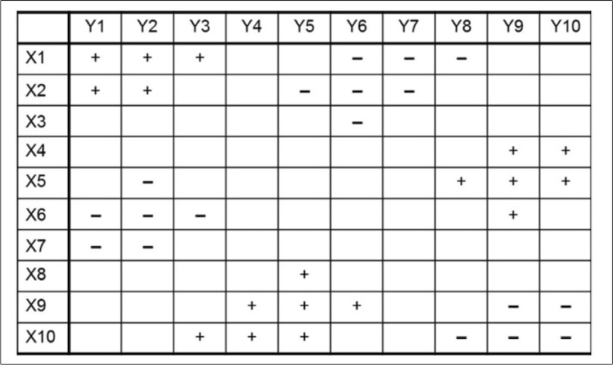

# BeanFest simulation 

This simulation is based on the XCAL error driven learning sim.

## Background

The current model can be viewed as one potential way of modeling Reinforcement Learning.  

This model is based on Eiser, Fazio, Stafford, and Prescott's (2003) connectionist model of Fazio and Eiser's BeanFest paradigm.  Fazio and Eiser (2000) were interested in capturing individual differences in how people learned from reward and punishment and then how they would generalize what they learned to decision-making. To capture these two dimensions, they developed a "game" called BeanFest. In BeanFest, participants play a computer game that consists of a training phase and a testing phase. During the training phase, participants learn to associate positive and negative values to 36 “beans” (a.k.a., game beans). The 36 game beans are selected from six regions of a matrix (refer to Figure 1 and Figure 4), where beans within the same region have the same valence (+10 or -10 points). Participants start off with 50 points and they are aiming to reach 100 points, which would be winning.  However, if their point total drops to 0, they lose and the game starts over.  Participants who decide to eat a Good Bean gain 10 points and participants who decide to eat a Bad Bean lose 10 points. Further, participants' points drop by 1 point for each choice opportunity, regardless of their choice. Thus, participants who decide not to eat a Bean, will lose 1 point.  

Figure4.jpg

There are equal numbers of good and bad game beans. These game beans vary on two dimensions – roundness and number of specks. Participants must learn the similarity structure (prototype representation) among the Beans.  There is no explicit rule that distinguishes between Good and Bad beans.  

During the testing phase, participants are asked to recall the valence of the 36 game beans as well as predict the valence of 64 new beans (a.k.a., novel beans) that they did not encounter during training (for a more detailed description and review of the BeanFest paradigm, see Fazio, Pietri, Rocklage, and Shook, 2015). The accuracy of recalling the valence of learned beans is often used to describe learning bias. If a participant is accurate at recalling the quality of good beans but incorrectly recalled some of the bad beans as “good”, then this participant has a positive learning bias, and vice versa. The attitude generalization towards novel beans is often used to describe participants’ valence bias. If a participant categorized more novel beans as good beans, then this participant has a positive weighting bias and vice versa. 

One important way in which the current model differs from the original BeanFest simulation, is that Eiser and Fazio represented evaluation by a single node that varied from negative to positive. In contrast, we have separate representations for Positive and Negative evaluation.  Past research has  established that positive and negative evaluation should not be conceptualized as a single continuum, and should be considered as separate dimensions (Cacioppo, Gardner, and Berston, 1997; Cacioppo, Gardner, and Bernston, 1999; Davidson, Ekman, Saron, Senulis, and Friesen, 1990; Higgins, 1997; Watson, Wiese, Vaidya, and Tellegen, 1999).  

Treating positive and negative evaluation as two separate processes allows us to consider the strengths for positive and negative valence weighting independently.

## Network Structure

### Layers

The current network consists of five layers: 
- Input layer represents the beans shown to the participants 
- Hidden layer represents the process of bean recognition and association with outcome value 
- PosEval and NegEval layers represent participants’ separate evaluation of how good/bad a bean might be
- Output layer represents the participants’ choice of whether a bean is good or bad. Output layer implements competition between two nodes representing two choices: Eat a Bean, Don't Eat a Bean. 
	- Node that wins the competition represents the Choice. 
- PosEval layer is wired only to the Eat a Bean node, whereas the NegEval layer is wired only to the Don't Eat a Bean node. 

The Input layer is consistent with  the original models proposed by Eiser et al. (2003). It has a 2 x 11 structure, where the two “rows” of eleven nodes represent the two dimensions that the input beans contain – shape and specks. The two dimensions of beans are vector-coded to give a “distributed” bump like representation, so the beans that have similar features will have a greater overlap in input activation. A bump toward the left side represents rounder items or fewer specks depending on the row.  Bumps toward the right side represent more oval beans or ones with more specks.  One can see this structure by going through training trials, one by one.

## Training

The training data used in this study is consistent with that of the original BeanFest paradigm. On a 10 by 10 grid encoding the 100 different beans (represented by the 2 by 11 input layer), six clusters of beans were chosen. Three clusters were deemed as “good” beans, and the other three clusters were “bad” beans, resulting in a total of 36 training beans, with equal numbers of good and bad beans (for the full training data, refer to “BF_train.tsv” file in project folder). However, unlike the original study, the current study only used one training set among all participants, and did not counterbalance the quality of the beans.

One can vary the parameters as noted below and then click Init and then Train and then click on TrnEpcPlot to follow the progress of the training and the impact of the various parameters.  

 ## Testing
 
 For the testing phase, all 100 beans – 36 game beans and 64 novel beans – were tested once each (for the full testing data, refer to “BF_test.tsv” file in project folder). Participants were allowed to make a “null” choice if they were unsure (i.e., when both output nodes had less than .1 activation).
 
 
 ## Varying parameters
 
 The current version of the model allows one to vary a number of different characteristics of the model.
 1. The NegValen and PosValen fields allow one to examine one possible individual difference in the respective weighting of the NegEval and PosEval in making a decision.  One can vary how strongly the activation of the NegEval and the PosEval layers influence their respective decision nodes. This can be used to model individual differences in the extent to which people weight positive and negative valences.   The PosEval node drives the activation of the decision node in the Output layer to Eat the Bean, whereas the NegEval node drives the activation of the decision node in the Output layer to Not Eat the Bean. The NegValen and PosValen values scale the strength of the weight from the evaluation nodes to the Output nodes.  So the default values of 1 do not change the weight scale.  
 
 2. The Fb_prob field allows one to vary the probability of getting feedback about the Valence of a Bean when you decide not to eat it.  Fazio and Eiser originally developed two versions of the BeanFest game. In the non-contingent version of the game, you get feedback about the valence of the Bean regardless of whether you decide to eat it. In contrast, in the contingent version of the game you only get feedback when you decide to eat the bean.  If you don't eat the bean you don't get any feedback about whether it is good or bad. So in the contingent feedback version people do not learn well about the actual value of Beans that they initially think are Bad.  So if Fb_prob is 0 you don't get any feedback when you don't eat the bean, whereas if it is 100 you always get feedback. This allows one to see how much feedback is needed about Beans you don't eat, in order to accurately learn about all the beans.
 3. Finally, the current version of the model is designed so that its choice of whether or not to eat a Bean is a function of its current energy level.  Lower energy increases the likelihood of choosing to eat a bean. The K value in the Sim field is a parameter that controls how steep the function is that relates current energy level to Bean choice.  
 
### References 

Eiser, R. J., Fazio, R. H., Stafford, T., & Prescott, T. J. (2003). Connectionist simulation of attitude learning: Asymmetries in the acquisition of positive and negative evaluations. *Personality and Social Psychology Bulletin, 29(10),* 1221-1235. 

Fazio, R. H., & Eiser, J. R. (2000, October). *Attitude formation through associative learning: Valence asymmetries.* Paper presented to the annual meeting of the Society for Experimental Social Psychology, Atlanta, GA.

Fazio, R. H., Pietri, E. S., Rocklage, M. D., & Shook, N. J. (2015). Positive versus negative valence: Asymmetries in attitude formation and generalization as fundamental individual differences. *Advances in Experimental Social Psychology, 51,* 97-146.